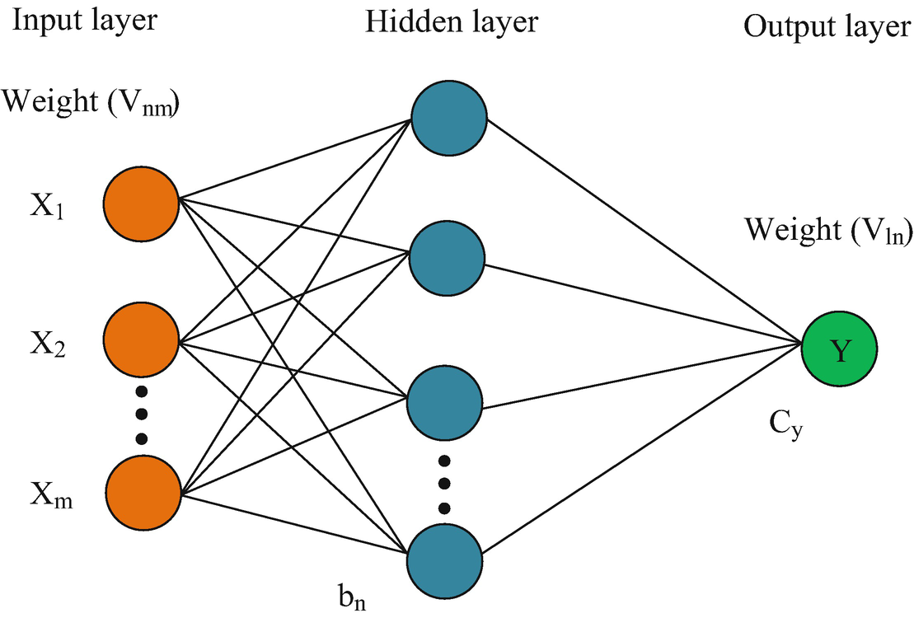
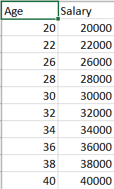
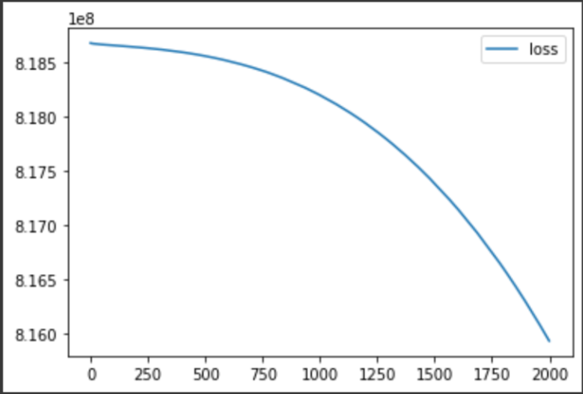
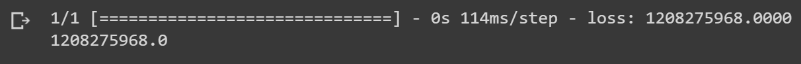
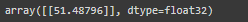

# Developing a Neural Network Regression Model

## AIM

To develop a neural network regression model for the given dataset.

## THEORY

Neural network regression is a supervised learning method, and therefore requires a tagged dataset, which includes a label column. Because a regression model predicts a numerical value, the label column must be a numerical data type. You can train the model by providing the model and the tagged dataset as an input to Train Model.

In this experiment we need to develop a Neural Network Regression Model so first we need to create a dataset (i.e : an excel file with some inputs as well as corresponding outputs).Then upload the sheet to drive then using corresponding code open the sheet and then import the required python libraries for porcessing.

Use df.head to get the first 5 values from the dataset or sheet.Then assign x and y values for input and coressponding outputs.Then split the dataset into testing and training,fit the training set and for the model use the "relu" activation function for the hidden layers of the neural network (here two hidden layers of 4 and 6 neurons are taken to process).To check the loss mean square error is uesd.Then the testing set is taken and fitted, at last the model is checked for accuracy via preiction.

## Neural Network Model



## DESIGN STEPS

### STEP 1:

Loading the dataset

### STEP 2:

Split the dataset into training and testing

### STEP 3:

Create MinMaxScalar objects ,fit the model and transform the data.

### STEP 4:

Build the Neural Network Model and compile the model.

### STEP 5:

Train the model with the training data.

### STEP 6:

Plot the performance plot

### STEP 7:

Evaluate the model with the testing data.

## PROGRAM
```
Developed By: Shriram.R
Register Number: 212221240053

import pandas as pd

from sklearn.model_selection import train_test_split
from sklearn.preprocessing import MinMaxScaler
from tensorflow.keras.models import Sequential
from tensorflow.keras.layers import Dense

df=pd.read_csv("/content/Datasheet - Sheet1.csv")

df.head()

X = df[["Input"]].values
X

Y = df[["Output"]].values
Y

X_train, X_test, Y_train, Y_test = train_test_split(X,Y, test_size=0.33, random_state=33)

Scaler = MinMaxScaler()

Scaler.fit(X_train)
Scaler.fit(X_test)

X_train1 = Scaler.transform(X_train)
X_test1 = Scaler.transform(X_test)
X_train1

ai_brain = Sequential([
    Dense(8, activation = 'relu'),
    Dense(10, activation = 'relu'),
    Dense(1)])

ai_brain.compile(
    optimizer = 'rmsprop',
    loss = 'mse'
)

ai_brain.fit(X_train1, Y_train, epochs=2000)

lossai_brain=pd.DataFrame(ai_brain.history.history)
lossai_brain.plot()

ai_brain.evaluate(X_test1,Y_test)

Xn1=[[30]]
Xn11=Scaler.transform(Xn1)
ai_brain.predict(Xn11)

```
## Dataset Information


## OUTPUT

### Training Loss Vs Iteration Plot


### Test Data Root Mean Squared Error


### New Sample Data Prediction

## RESULT
Thus, the neural network model regression model for the given dataset is developed.